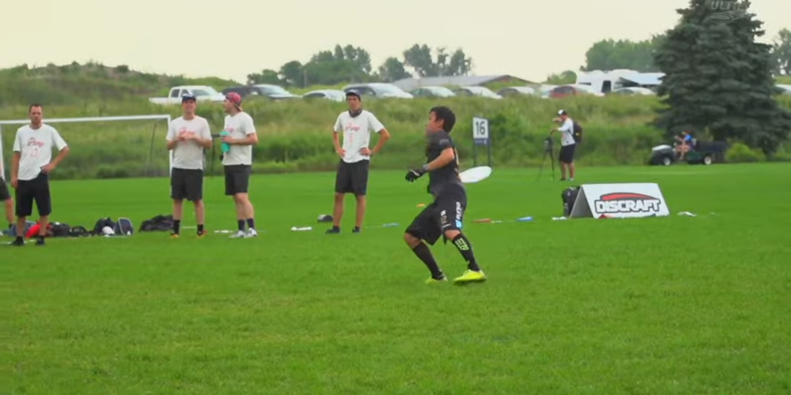

# Análisis de juego Buzz Bullets vs PoNY

## Observaciones del juego en general

-   `7'` de juego, Buzz Bullets anotó, pero si se fijan bien, el gol no debió contar ya que el lanzador hizo un travel muy marcado
    
-   `34'` _Buzz Bullets_ recibe el pull, los jugadores de _PoNY_ o no se comunicaron apropiadamente o no corrieron enérgicamente, en 3 pases anotó _Buzz_
-   `37'` Los jugadores de _Buzz_ no conectaron el 2do pase después del pull, _PoNY_ intentó una jugada a break pero no se dió, el ancla hace un incut y en seguida _up the line_ con el _handler_ principal
-   `44'` _PoNY_ parece que llama a una jugada de _End Zone_, la anotación fue entre _handlers_, los cortadores permanecían estáticos o jalando a su marca
-   `54'` _Buzz_ juega una defensa en copa y _PoNY_ pierde el disco en su _End Zone_, después de una serie de pases, _Buzz_ anota el gol de una forma un tanto _"forzada | arriesgada"_
-   `59'` _PoNY_ juega el disco, armaron una combinación de _dump - swing_ y al momento de intentar darle continuidad con un _up the line_, dos jugadores de _Buzz_ evitan el pase, que fueron la marca del cortador y la marca del lanzador, leyó y cazó muy bien la jugada para después iniciar el labor de marcaje al disco. En una sucesión de pases después, _PoNY_ rompe dos veces
-   `60'` En este punto, _PoNY_ no ha conseguido anotar previo a la descripción anterior, mantiene la posesión cerca del _End Zone_ y un jugador de _PoNY_ corre de espaldas a su _handler_ pudiendo ser opción de gol o reciclaje. Su anotación termina siendo arriesgada (_hammer_ + _layout_) a la falta de cortes activos y por la presión de la defensa
-   `60' + 6'` _Huck_ a favor de _Buzz_, un jugador de _PoNY_ intenta defenderlo pero el disco continuaba vivo, terminó siendo gol por el rescate del disco del jugador de _Buzz_
    * Nota: En esta jugada, también hubo travel
-   `60' + 13'` _Buzz_ nuevamente hace una muy buena defensa en zona, lo que provoca que _PoNY_ pierda el disco cerca de su _End Zone_. Después de una serie de pases, mantiendo la posesión y presión al estar a nada de anotar, lo consiguen.

## Observaciones del juego de PoNY

-   Tienen una técnica y ritmo de juego muy bien aprovechado, rompen cuando es necesario, tiran _hucks_ cuando hay oportunidad y se mantienen con un buen espacio disponible para desarrollar su juego
-   Aprovechan bastante bien su altura con su juego a tirar largos
-   A pesar de que su estilo de juego tiende a preferir los _hucks_, tienen un buen juego a mediana distancia
-   En las defensas de zona se precipitaban un poco, de ahí las jugadas y puntos en contra que recibieron

## Observaciones del juego de Buzz Bullets

-   Aprovechan totalmente el ancho del campo, no se quedan en una banda por mucho tiempo, se mantienen en el centro pero si hay que ir a los laterales lo hacen
-   Lanzamientos muy rápidos, tirándole a balas, un juego muy dinámico, aunque en algunas ocasiones les jugaron en contra
-   Sufrieron varias veces con los _breaks_ que les hacían, pero su defensa a la zona libre estuvo muy bien planteada
-   A pesar de que en el juego hubo _travels_, a ellos se les notaba más ya que era específicamente en _hucks_
